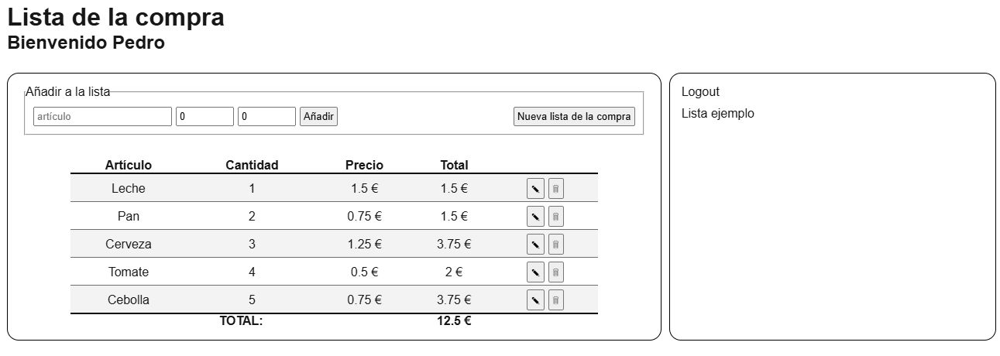

# Ejercicio Bootcamp lista de la compra con React

Repositorio de José Ramón Carralero. Ejercicio del Bootcamp de Neoland, que consiste en crear una lista de la compra, hecho con React.

## Descripción

La aplicación consiste en una lista de la compra a la que podemos añadir articulos, indicando la cantidad y el precio. La lista calculará automaticamente el total.

Tiene una simulación de login, al que se accede con el usuario "<prueba@email.com>" con la contraseña "1234". Además tiene la opción de cargar una lista creada por defecto.

Para la gestión de los datos se usa un Reducer.

En este repositorio se aplican los siguiente conocimientos adquiridos durante el curso:

* HTML
* CSS
* Javascript
* Principios SOLID
* React
* JSDocs para la documentación
* GitHub para gestión de repositorios

## Dependencias de la aplicación

* React
* Nextjs
* ESLint
* Jsdoc
